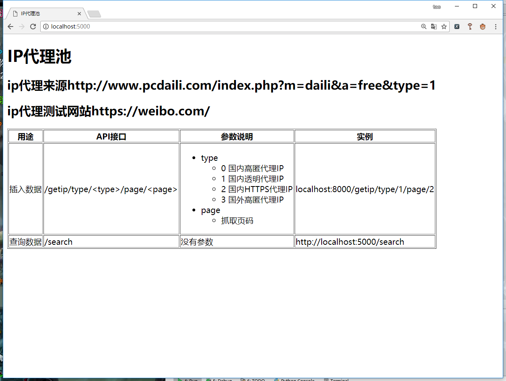
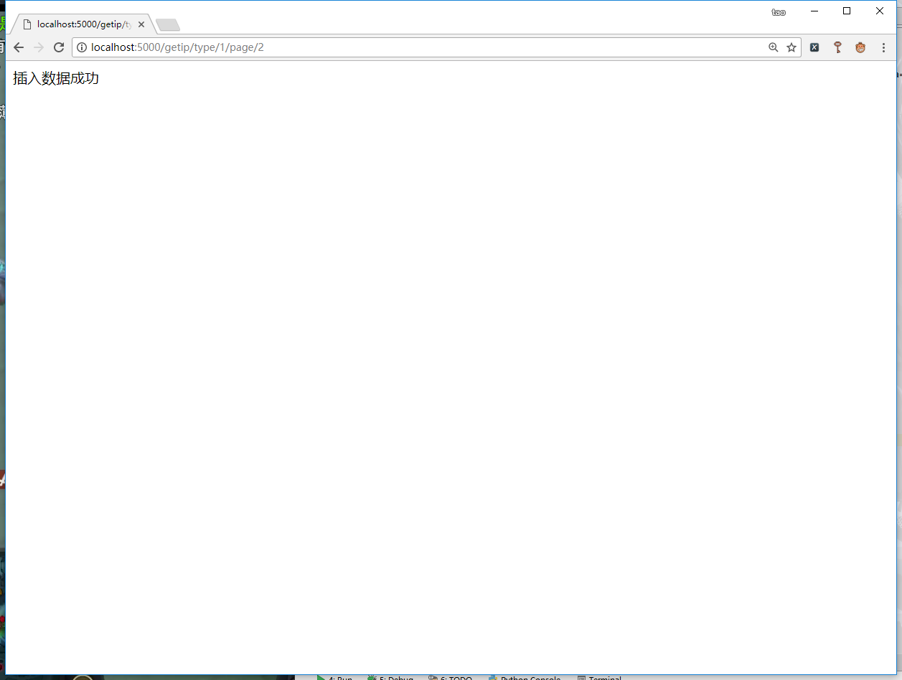
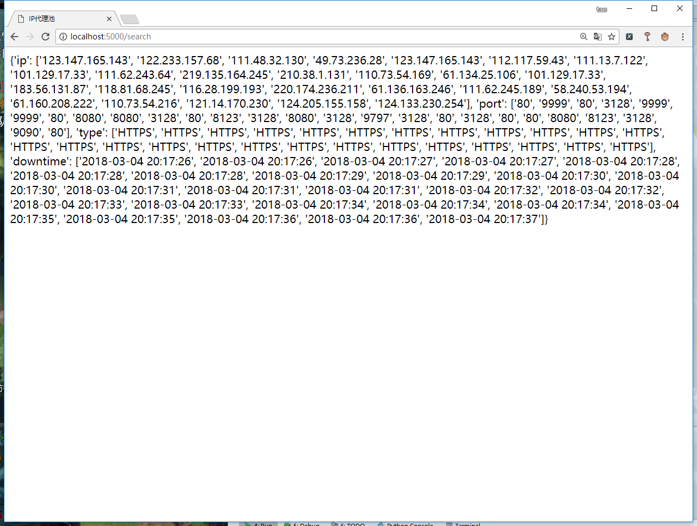
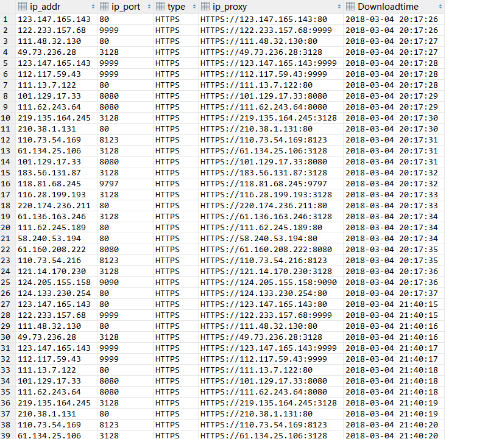

# IP代理池
## 目录说明
API     API接口
config   配置
db      数据库操作
log     日志
spider  爬虫目录
test    测试
util    工具

## 运行程序
cd API
python flask_spider_main

## url地址
首页    localhost:5000
插入数据库   http://localhost:5000/getip/type/1/page/2
查询数据库   http://localhost:5000/search

## 执行效果
首页

插入

查询

数据表

